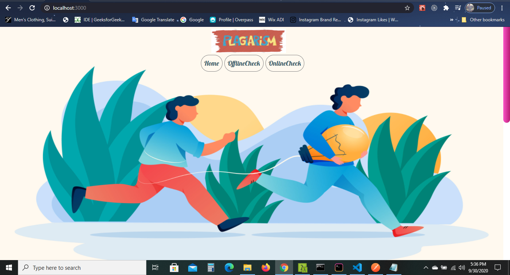
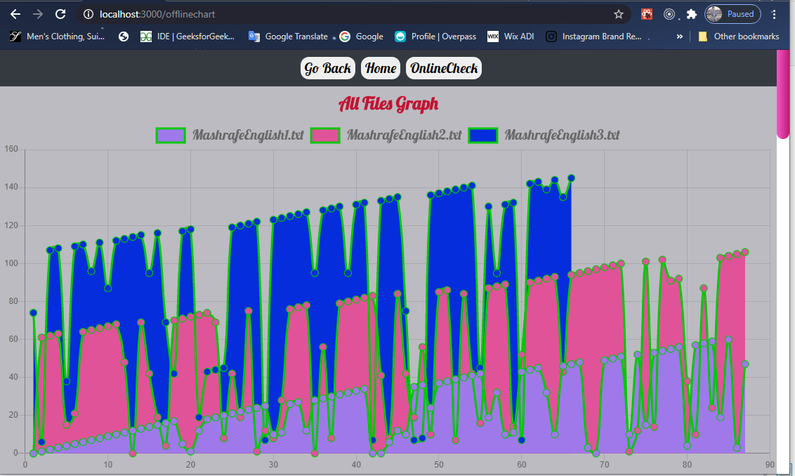
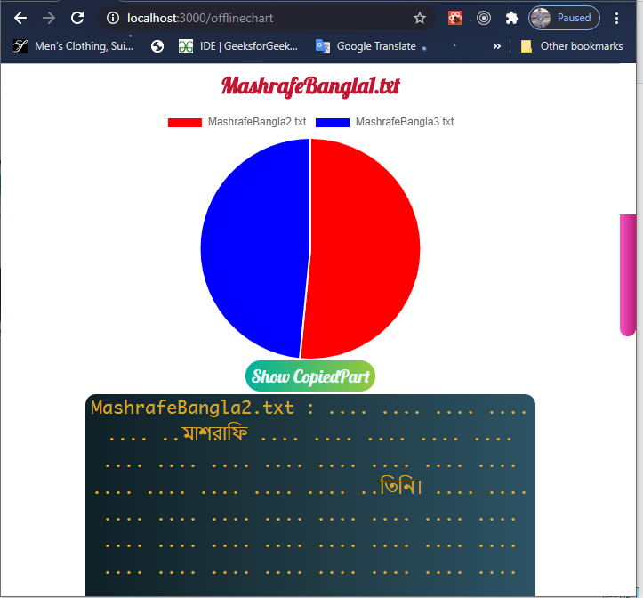
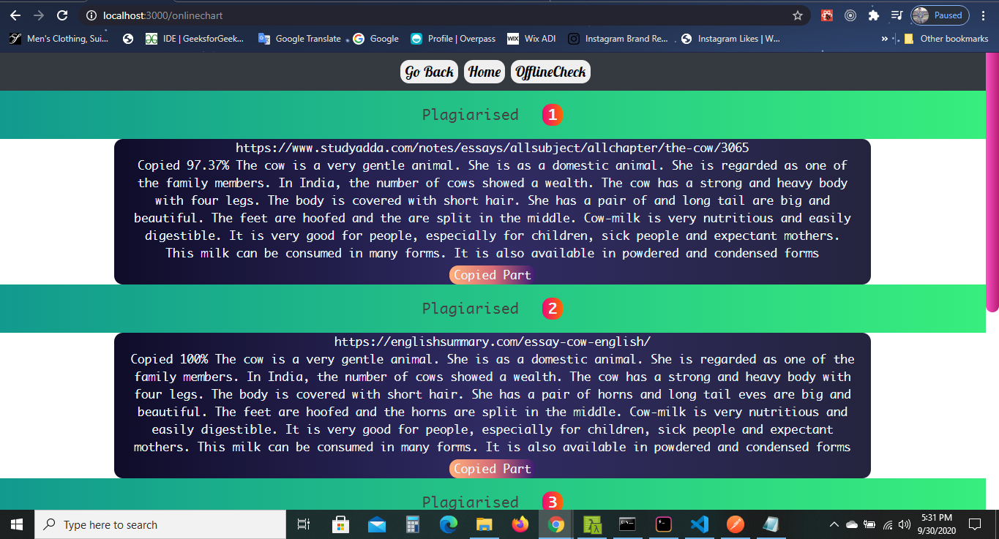

# My Plagiarism-Checker Built on Nodejs & ReactJs  

## Features : 
### 1.This Plagiarism Chekcer can check plagiarism both in offline & online
### 2.In OfflineCheck it checks plagiarism of files and displays all files plagiarism grphically by `scatter plot`,average plagiarism in `bar chart`,individual plagiarism in `pie chart`
### 3.In Addition it informs the percentage of copy when mouse hovers on plots & copied part in text form.
### 4. It also can check the plagiarism of `Bengali files` & `Code files`
### 5. In Online Check it shows the top 10 websites link from where the content was copied 
### 6. Again , Online check also exhibits the percentage of copying and copied part in text form 

## How to use it :
### 1. `Client Setup` : Firstly download the project & Open it in terminal  & go inside `Client` Directory running the command `cd Client`
### 2. Then run the command `npm install`. It will automatically install all of the packages mentioned in `package.json` file required for Running React App.Prior to that make sure that `create-react-app` is installed globally on your pc
### 3.After Successfull installation of all packages run the command `npm start` it will automatically open React app in `port:3000`. To see the interface above Open a new tab in your browser and type `http://localhost:3000/` and hit enter
### 4. `Server Setup`: After that go inside `Server` folder running the commands `cd ..` & `cd Server`
### 5. Then run the command `npm install` and it will install automatically all of the packages required for running back-end NodeJs app
### 6. After Installation if you run the command `node server.js` then your server will run & can communicate with your front-end React app 
### 7. At last there is one simple thing to change in `server.js` file  `https://www.googleapis.com/customsearch/v1?key=${process.env.API_KEY}&cx=${process.env.GOOGLE_SEARCH_ENGINE_ID}&q=${req.query.text}`
### go to [Googles Developer Console](https://console.developers.google.com/) and create a new app & grab the api key from there. then replace your api-key in place of `process.env.API_KEY`
### finally go to [Google Custom Search Engine (CSE)](https://cse.google.com/cse/all) and create a new search engine for you and grab the `engine-id` from there to replace here `process.env.GOOGLE_SEARCH_ENGINE_ID`
### That's all now you can enjoy all of the features described above .In offlineCheck Results may look like 

### In OnlineCheck Results may look like 

